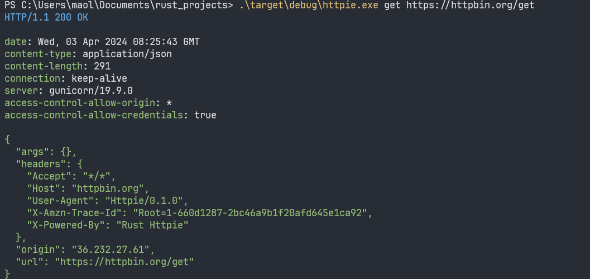

# Rust Projects

- [Httpie](./httpie/README.md) is a command-line HTTP client.
    >运行截图
    
    

- [ChineseSearchEngine](./chinese_search_engine/README.md) is a simple Chinese search engine.
    >运行截图
    

- [Single Sign-On (SSO) Services](./sso/py/README.md) 
    > 这个项目实现了一个基于 Flask 和 JWT 的单点登录（SSO）系统，包含两个主要部分：SSO 认证服务和应用接入。SSO 认证服务负责处理用户的登录请求、生成和验证令牌；应用接入则利用这些令牌来校验用户的身份，确保只有验证通过的用户才能访问受保护的应用资源。