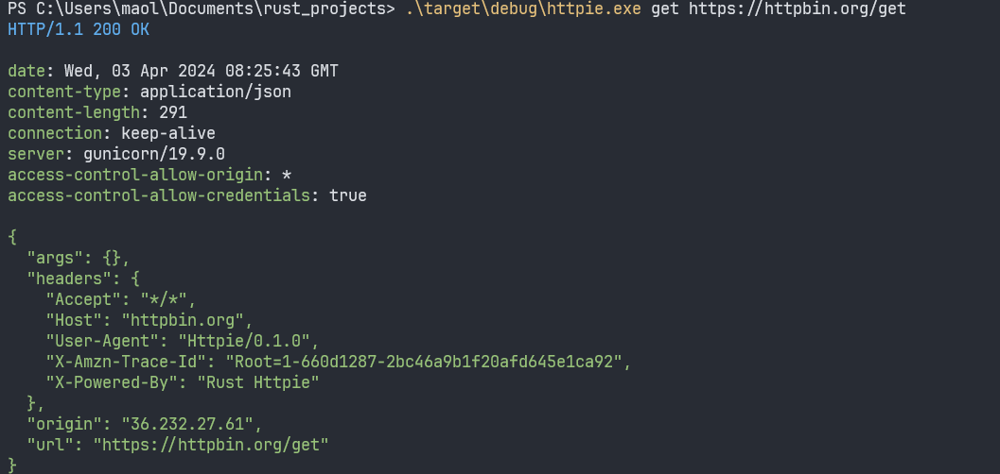
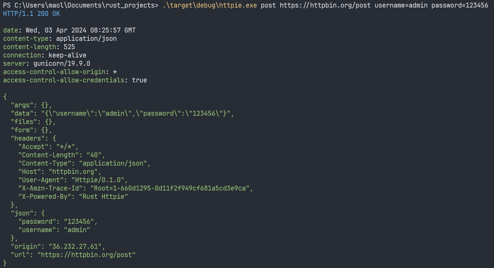

# Rust 实现的 Httpie 命令行 HTTP 客户端

> Httpie is a command-line HTTP client.

>运行截图



Httpie 是一个简单易用的命令行 HTTP 客户端，用于发送 HTTP 请求和测试 API。这个 Rust 版本的 Httpie 保留了原版的简单易用性，同时提供了 Rust 语言的性能优势。

## 特性

- **简单直观**：易于使用的命令行选项和清晰的输出格式。
- **高性能**：利用 Rust 的性能优势，提供快速的请求处理能力。
- **跨平台**：支持 Windows、macOS 和 Linux 系统。

## 安装

目前，您可以通过编译源代码来安装 Rust 版本的 Httpie。确保您已经安装了 Rust 环境。

1. 克隆仓库到本地：
```bash
git clone https://your-repository-url/httpie-rust.git
cd httpie-rust
```

2. 编译项目：
```bash
cargo build --release
```

3. 将编译好的可执行文件`httpie.exe`（或在 Unix 系统中为`httpie`）添加到您的 PATH 环境变量中，以便在任何位置使用。

## 使用方法

使用`httpie`非常简单，以下是一些基本的命令示例：

### 获取资源

```bash
# cargo run --package httpie --bin httpie  get https://httpbin.org/get

httpie get https://httpbin.org/get
```

这将发送一个 GET 请求到指定的 URL。

### 发送数据

```bash
httpie post https://httpbin.org/post username=admin password=123456
```

这将通过 POST 请求发送数据到指定的 URL。

### 查看帮助

```bash
httpie help
```

或者，查看特定子命令的帮助：

```bash
httpie help get
```

## 选项

- `-h`, `--help`：打印帮助信息。
- `-V`, `--version`：打印版本信息。

## 贡献

欢迎通过 GitHub 仓库贡献代码或提出问题。我们欢迎任何形式的贡献，包括新功能、代码审查、文档改进或报告问题。

## 许可证

该项目采用 MIT 许可证。详见 [LICENSE](LICENSE) 文件。

---

祝您使用愉快！
